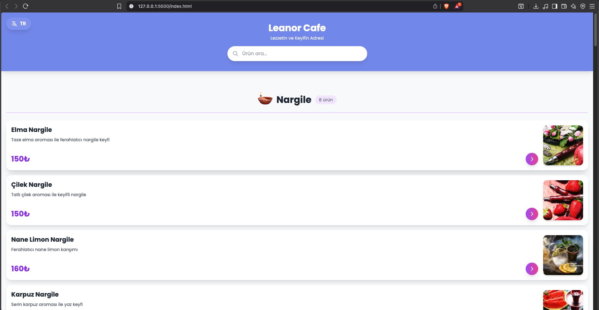
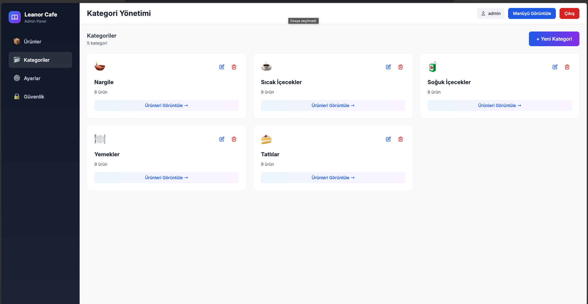
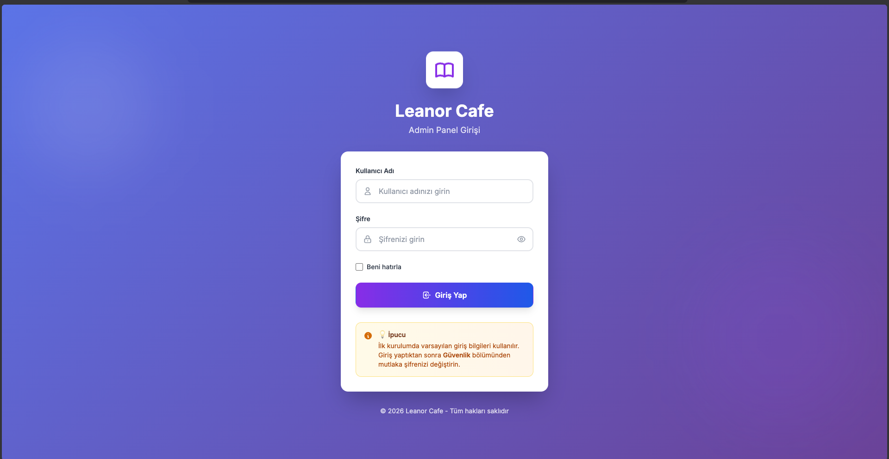
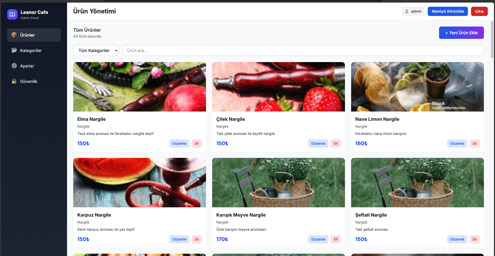

# Leanor Cafe - Digital Menu System

Modern, responsive ve çok dilli dijital menü sistemi. QR kod ile erişilebilir, admin paneli ile kolayca yönetilebilir.

## 📸 Ekran Görüntüleri

### Müşteri Menüsü

*Mobil-first responsive tasarım, yatay scroll kategoriler*

### Admin Paneli - Giriş

*Modern gradient tasarım ile güvenli giriş*

### Admin Paneli - Ürün Yönetimi

*Kolay ürün ekleme, düzenleme ve silme*

### Admin Paneli - Kategori Yönetimi

*Kategori kartları ile görsel yönetim*

## 🌟 Özellikler

### Müşteri Menüsü
- 📱 Mobil-first responsive tasarım
- 🌍 Çoklu dil desteği (TR/EN)
- 🔍 Canlı arama özelliği
- 🎨 Modern gradient tasarım
- 📸 Ürün fotoğrafları ve detaylı bilgiler
- 🎯 Yatay scroll kategori navigasyonu
- ✨ Smooth animasyonlar

### Admin Paneli
- 🔐 Güvenli giriş sistemi
- ➕ Ürün ekleme/düzenleme/silme
- 📂 Kategori yönetimi
- 🖼️ Fotoğraf yükleme (Base64)
- ⚙️ Genel ayarlar (Cafe adı, slogan)
- 🔒 Şifre değiştirme
- 💾 Veri yedekleme (JSON export)
- 🔥 **Firebase gerçek zamanlı senkronizasyon**

## 🔥 Firebase Gerçek Zamanlı Senkronizasyon

Proje, Firebase Firestore kullanarak gerçek zamanlı veri senkronizasyonu sağlar:

- **Admin panelinde yapılan değişiklikler** (ürün ekleme, düzenleme, silme, kategori yönetimi, ayarlar) anında Firebase'e kaydedilir
- **Müşteri menüsü** Firebase'den gerçek zamanlı güncellemeleri dinler ve otomatik olarak yenilenir
- **Tüm kullanıcılar** aynı anda güncel verileri görür
- **İlk kurulumda** varsayılan menü verileri otomatik olarak Firebase'e yüklenir

### Firebase Yapılandırması

Firebase yapılandırması `firebase-config.js` dosyasında bulunur. Kendi Firebase projenizi kullanmak için:

1. [Firebase Console](https://console.firebase.google.com/) üzerinden yeni bir proje oluşturun
2. Firestore Database'i etkinleştirin (Test mode'da başlatabilirsiniz)
3. Web uygulaması ekleyin ve yapılandırma bilgilerini alın
4. `firebase-config.js` dosyasındaki yapılandırmayı kendi bilgilerinizle güncelleyin

```javascript
const firebaseConfig = {
  apiKey: "YOUR_API_KEY",
  authDomain: "YOUR_PROJECT.firebaseapp.com",
  projectId: "YOUR_PROJECT_ID",
  storageBucket: "YOUR_PROJECT.firebasestorage.app",
  messagingSenderId: "YOUR_SENDER_ID",
  appId: "YOUR_APP_ID"
};
```

### Firestore Güvenlik Kuralları

Üretim ortamında aşağıdaki güvenlik kurallarını kullanmanız önerilir:

```javascript
rules_version = '2';
service cloud.firestore {
  match /databases/{database}/documents {
    // Herkes okuyabilir (müşteri menüsü için)
    match /{document=**} {
      allow read: if true;
    }
    
    // Sadece admin yazabilir (admin paneli için)
    match /{document=**} {
      allow write: if request.auth != null;
    }
  }
}
```

## 🚀 Kurulum

1. Projeyi klonlayın:
```bash
git clone https://github.com/kullaniciadi/leanor-cafe.git
cd leanor-cafe
```

2. Tarayıcıda açın:
- Müşteri menüsü: `index.html`
- Admin paneli: `login.html`

## 🔑 Varsayılan Giriş Bilgileri

**Kullanıcı Adı:** admin  
**Şifre:** admin123

⚠️ İlk girişten sonra mutlaka şifrenizi değiştirin!

## 📁 Dosya Yapısı

```
leanor-cafe/
├── index.html          # Müşteri menüsü (ana sayfa)
├── script.js           # Müşteri menüsü JavaScript
├── login.html          # Admin giriş sayfası
├── admin.html          # Admin panel
├── admin-modern.js     # Admin panel JavaScript
├── settings.html       # Ayarlar sayfası (boş)
└── README.md           # Dokümantasyon
```

## 💾 Veri Saklama

Tüm veriler tarayıcının LocalStorage'ında saklanır:
- `menuData` - Ürün verileri
- `categories` - Kategori listesi
- `settings` - Genel ayarlar
- `adminCredentials` - Giriş bilgileri
- `language` - Dil tercihi

## 🎨 Teknolojiler

- HTML5
- CSS3 (Tailwind CSS)
- Vanilla JavaScript
- LocalStorage API
- Unsplash (Fotoğraflar)

## 📱 Kullanım

### Müşteri Tarafı
1. QR kod ile `index.html` sayfasını açın
2. Kategorilere göz atın (yatay scroll)
3. Ürünlere tıklayarak detayları görün
4. Dil değiştirmek için sol üstteki butonu kullanın

### Admin Tarafı
1. `login.html` sayfasından giriş yapın
2. Ürünler bölümünden ürün ekleyin/düzenleyin
3. Kategoriler bölümünden kategori yönetin
4. Ayarlar'dan cafe bilgilerini güncelleyin
5. Güvenlik'ten şifrenizi değiştirin

## 🌐 Dil Desteği

Sistem şu anda 2 dili desteklemektedir:
- 🇹🇷 Türkçe
- 🇬🇧 İngilizce

Yeni dil eklemek için `script.js` dosyasındaki `translations` ve `productTranslations` objelerini güncelleyin.

## 🔧 Özelleştirme

### Renkleri Değiştirme
Gradient renkler `index.html` ve `login.html` dosyalarındaki CSS'te tanımlıdır:
```css
background: linear-gradient(135deg, #667eea 0%, #764ba2 100%);
```

### Kategori Ekleme
Admin panelinden veya `admin-modern.js` dosyasındaki `categories` dizisini düzenleyin.

## 📸 Fotoğraf Yükleme

- Admin panelinden PC'den fotoğraf yükleyebilirsiniz
- Maksimum dosya boyutu: 2MB
- Desteklenen formatlar: JPG, PNG, WebP, GIF
- Fotoğraflar Base64 formatında saklanır

### Fotoğraf Ekleme Adımları:
1. Admin paneline giriş yapın
2. **Ürünler** bölümüne gidin
3. Ürün ekle veya düzenle butonuna tıklayın
4. **Fotoğraf** alanından "Dosya Seç" butonuna tıklayın
5. Bilgisayarınızdan fotoğraf seçin (max 2MB)
6. Kaydet butonuna tıklayın

### Önerilen Fotoğraf Boyutları:
- Genişlik: 800px
- Yükseklik: 600px
- Format: JPG veya PNG
- Kalite: Orta-Yüksek (dosya boyutunu düşük tutmak için)

## 🚨 Önemli Notlar

- Veriler tarayıcıda saklandığı için tarayıcı verilerini temizlerseniz tüm veriler silinir
- Düzenli olarak veri yedeği alın (Admin Panel > Ayarlar > Verileri Yedekle)
- Üretim ortamında güvenlik için backend entegrasyonu önerilir

## 📄 Lisans

Bu proje MIT lisansı altında lisanslanmıştır.

## 👨‍💻 Geliştirici

Leanor Cafe Digital Menu System

## 🤝 Katkıda Bulunma

1. Fork edin
2. Feature branch oluşturun (`git checkout -b feature/amazing-feature`)
3. Commit edin (`git commit -m 'Add some amazing feature'`)
4. Push edin (`git push origin feature/amazing-feature`)
5. Pull Request açın

## 📞 İletişim

Sorularınız için issue açabilirsiniz.

---

⭐ Projeyi beğendiyseniz yıldız vermeyi unutmayın!
